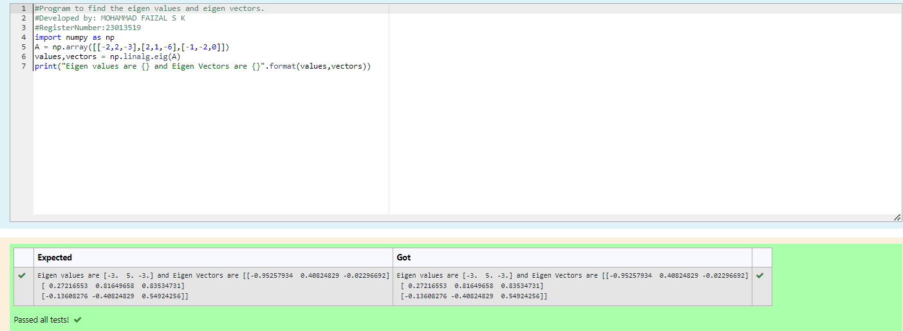

# EIGENVALUES-AND-EIGENVECTORS
## Aim:
To write a python program to find the Eigenvalues and Eigen Vectors
## Equipment’s required:
1. 	Hardware – PCs
2. 	Anaconda – Python 3.7 Installation / Moodle-Code Runner
## Algorithm:
### Step1 :

Import the module numpy and assign numpy as np

### Step 2:

Create an variable named 'a' and use np.array() for the matrix values by first list as first row and so on

### Step 3:

Using the np.linalg.eig(), we get two results (first is eigenvalue and second is eigenvector) of the given matrix.

### Step 4:

Print the Eigenvalue and Eigenvector
## Program:
```py
#Program to find the eigen values and eigen vectors.
#Developed by: MOHAMMAD FAIZAL S K
#RegisterNumber:23013519
import numpy as np
A = np.array([[-2,2,-3],[2,1,-6],[-1,-2,0]])
values,vectors = np.linalg.eig(A)
print("Eigen values are {} and Eigen Vectors are {}".format(values,vectors))
```
## Output:

## Result:
Thus the Eigenvalue and Eigenvector is successfully solved using python program
